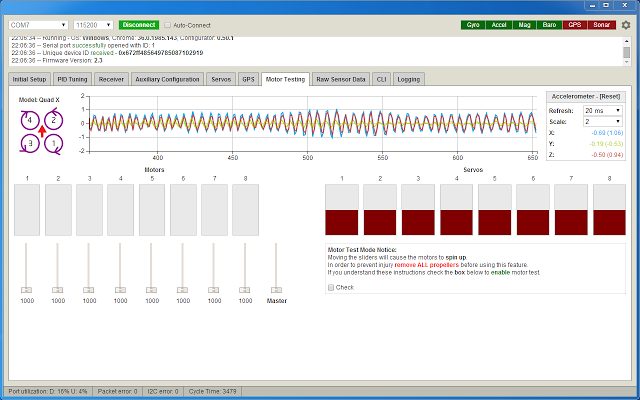

# Configuration

Cleanflight is configured primarilty using the Cleanflight Configurator GUI.

Both the command line interface and GUI are accessible by connecting to a serial port on the target,
be it a USB virtual serial port, physical hardware UART port or a SoftSerial port.

See the Serial section for more information and see the Board specific sections for details of the serial ports available on the board you are using.

The GUI cannot currently configure all aspects of the system, the CLI must be used to enable or configure
some features and settings.

__Due to ongoing development, the fact that the GUI cannot yet backup all your settings and automatic chrome updates of the GUI app it is highly advisable to backup your settings (using the CLI) so that when a new version of the configurator or firmware is released you can re-apply your settings.__

## GUI

The GUI tool is the preferred way of configuration.  The GUI tool also includes a terminal which
can be used to interact with the CLI.

[Cleanflight Configurator on Chrome store](https://chrome.google.com/webstore/detail/cleanflight-configurator/enacoimjcgeinfnnnpajinjgmkahmfgb)

If you cannot use the latest version of the GUI to access the FC due to firmware compatibility issues you can still access the FC via the CLI to backup your settings, or you can install an old version of the configurator.

Old versions of the configurator can be downloaded from the configurator releases page: https://github.com/cleanflight/cleanflight-configurator/releases
See the README file that comes with the configurator for installation instructions.
 

## CLI

Cleanflight can also be configured by a command line interface.

See the CLI section of the documentation for more details.
